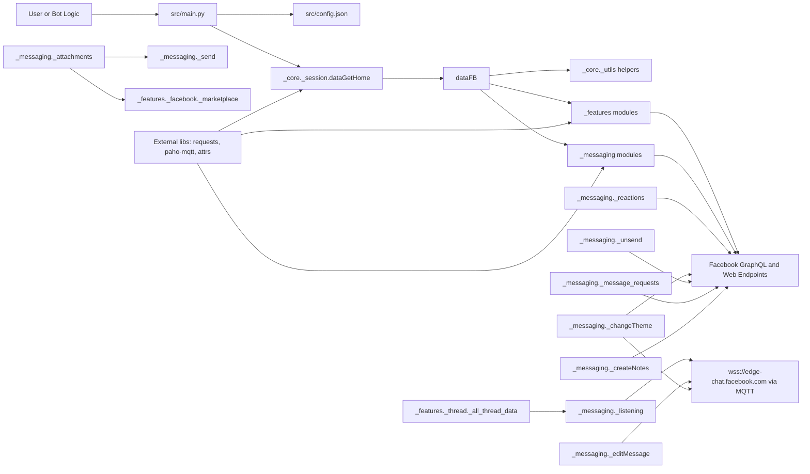
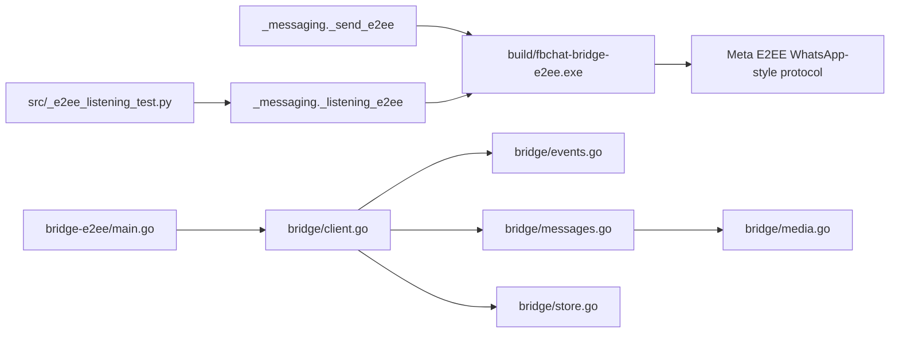

# Project Flowchart

This diagram covers the full repository structure (excluding deep internals in `.git/` and `.venv/`) and the main runtime flow inside `src/` plus the Go-based E2EE bridge.

## 1) Directory Flow (whole project)

```mermaid
flowchart TD
    REPO[fbchat-v2]

    REPO --> ROOT[Root Files]
    ROOT --> README[README.md]
    ROOT --> README_EN[README_EN.md]
    ROOT --> DOCS[DOCS.md]
    ROOT --> CHANGELOG[CHANGELOG.md]
    ROOT --> CLAUDE[CLAUDE.md]
    ROOT --> COC[CODE_OF_CONDUCT.md]
    ROOT --> LICENSE[LICENSE]
    ROOT --> REQ[requirements.txt]

    REPO --> META[Environment and Git]
    META --> GIT[.git/]
    META --> VENV[.venv/]
    META --> GHCFG[.github/]

    REPO --> WEB[website/]
    WEB --> WEB_HTML[index.html]
    WEB --> WEB_JS[script.js]
    WEB --> WEB_CSS[style.css]

    REPO --> LANG[language/]
    LANG --> LANG_README[language/README.md]
    LANG --> LANG_VI[language/vi_VN.lang]

    REPO --> BUILD[build/]
    BUILD --> BUILD_EXE[fbchat-bridge-e2ee.exe]

    REPO --> BRIDGE[bridge-e2ee/]
    BRIDGE --> BR_MAIN[main.go]
    BRIDGE --> BR_GOMOD[go.mod]
    BRIDGE --> BR_GOSUM[go.sum]
    BRIDGE --> BR_README[README.md]
    BRIDGE --> BR_PKG[bridge/]
    BR_PKG --> BR_CLIENT[client.go]
    BR_PKG --> BR_EVENTS[events.go]
    BR_PKG --> BR_MEDIA[media.go]
    BR_PKG --> BR_MSG[messages.go]
    BR_PKG --> BR_STORE[store.go]

    REPO --> SRC[src/]
    SRC --> SRC_MAIN[src/main.py]
    SRC --> SRC_CFG[src/config.json]
    SRC --> SRC_E2EE_TEST[src/_e2ee_listening_test.py]

    SRC --> CORE[src/_core/]
    CORE --> CORE_INIT[__init__.py]
    CORE --> CORE_SESSION[_session.py]
    CORE --> CORE_UTILS[_utils.py]
    CORE --> CORE_LOGIN[_facebookLogin.py]
    CORE --> CORE_README[README.md]
    CORE --> CORE_README_EN[README_EN.md]

    SRC --> FEATURES[src/_features/]
    FEATURES --> FB[src/_features/_facebook/]
    FEATURES --> TH[src/_features/_thread/]
    FEATURES --> FT_README[README.md]
    FEATURES --> FT_README_EN[README_EN.md]

    FB --> FB_INIT[__init__.py]
    FB --> FB_BLOCK[_blocking.py]
    FB --> FB_BIO[_changeBio.py]
    FB --> FB_POST[_createPost.py]
    FB --> FB_USER[_get_user_info.py]
    FB --> FB_MARKET[_marketplace.py]
    FB --> FB_NOTI[_notification.py]
    FB --> FB_PRO[_professional.py]
    FB --> FB_REG[_registerOnProfile.py]
    FB --> FB_SEARCH[_search.py]

    TH --> TH_INIT[__init__.py]
    TH --> TH_ADMIN[_addAdmin.py]
    TH --> TH_DATA[_all_thread_data.py]
    TH --> TH_EMOJI[_changeEmoji.py]
    TH --> TH_NAME[_changeNameThread.py]
    TH --> TH_NICK[_changeNickname.py]

    SRC --> MSG[src/_messaging/]
    MSG --> MSG_INIT[__init__.py]
    MSG --> MSG_ATTACH[_attachments.py]
    MSG --> MSG_THEME[_changeTheme.py]
    MSG --> MSG_NOTES[_createNotes.py]
    MSG --> MSG_EDIT[_editMessage.py]
    MSG --> MSG_LISTEN[_listening.py]
    MSG --> MSG_LISTEN_E2EE[_listening_e2ee.py]
    MSG --> MSG_REQ[_message_requests.py]
    MSG --> MSG_REACT[_reactions.py]
    MSG --> MSG_SEND[_send.py]
    MSG --> MSG_SEND_E2EE[_send_e2ee.py]
    MSG --> MSG_UNSEND[_unsend.py]
    MSG --> MSG_README[README.md]
    MSG --> MSG_README_EN[README_EN.md]
```

## 2) Runtime Flow (main source behavior)

## 3) E2EE Flow (Python ↔ Go bridge)

