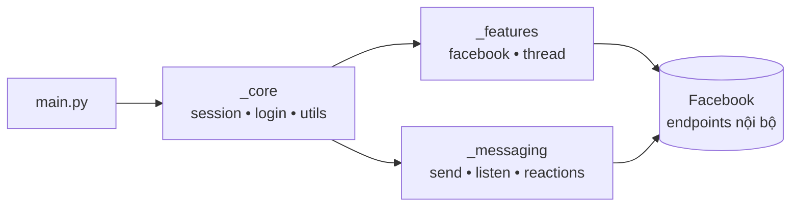
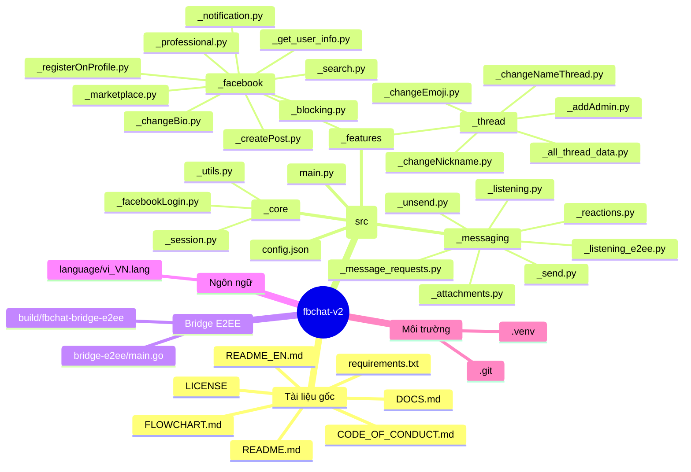

<div align="center">

# FBChat-Remake — Mã nguồn mở

### Thư viện Python hiện đại cho Facebook Messenger API (không chính thức), hoạt động trên tài khoản người dùng

[](https://github.com/MinhHuyDev/fbchat-v2)
[](https://www.python.org/)
[](https://github.com/MinhHuyDev/fbchat-v2/releases)
[](https://github.com/MinhHuyDev/fbchat-v2/issues)
[](LICENSE)
[](https://t.me/MinhHuyDev)

[**🇬🇧 English**](README_EN.md) · [**📖 Tài liệu**](DOCS.md) · [**📊 Sơ đồ luồng**](FLOWCHART.md) · [**🐛 Báo lỗi**](https://github.com/MinhHuyDev/fbchat-v2/issues)

</div>

---

## 📢 Thông báo quan trọng

> Kể từ **tháng 11/2024**, Facebook đã chính thức triển khai **mã hoá đầu cuối (End-to-End Encryption — E2EE)** cho mọi cuộc trò chuyện giữa người dùng với người dùng trên Messenger.
>
> **Cập nhật 12/05/2026:** `fbchat-v2` đã **chính thức hỗ trợ giải mã E2EE** cho tin nhắn cá nhân Messenger thông qua module mới [`_messaging/_listening_e2ee.py`](src/_messaging/_listening_e2ee.py) + binary Go [`bridge-e2ee/`](bridge-e2ee/). Schema sự kiện trả về **giống hệt** `_listening.py` cũ — chỉ cần đổi import là chạy.
>
> Tin nhắn nhóm vẫn dùng `_listening.py` (MQTT WebSocket) như trước; tin nhắn 1–1 dùng `_listening_e2ee.py`.

> ⚠️ **Tuyên bố miễn trừ** — Đây **không** phải là sản phẩm chính thức của Facebook. Facebook đã có sẵn API chatbot chính thức [tại đây](https://developers.facebook.com/docs/messenger-platform/). `fbchat-v2` khác biệt ở chỗ nó xác thực bằng **tài khoản / cookie người dùng Facebook thực**, vốn tiềm ẩn rủi ro. Hãy cân nhắc kỹ trước khi sử dụng.

---

## 👋 Giới thiệu

Xin chào, mình là **MinhHuyDev** / **raintee.dev** — tác giả và người duy trì dự án này.

Trước hết, mình xin chân thành cảm ơn tất cả người dùng trong và ngoài nước đã đóng góp ý tưởng và báo lỗi cho dự án. Trong **bản cập nhật lớn v2.x** này, codebase đã được **tái cấu trúc hoàn toàn**, xử lý phần lớn các lỗi nhỏ tồn đọng và đặt nền móng cho những tính năng sắp tới như **E2EE** và **`async`/`await`** đầy đủ.

Tất nhiên vẫn sẽ còn những lỗi vặt khó tìm ra, hoặc các đoạn code chưa thật sự đồng bộ. Nếu bạn phát hiện ra ***vấn đề***, hãy mở issue trên [GitHub](https://github.com/MinhHuyDev/fbchat-v2/issues) hoặc nhắn trực tiếp cho mình qua [Telegram](https://t.me/MinhHuyDev).

---

## 📑 Mục lục

- [Tính năng](#-tính-năng)
- [Kiến trúc tổng quan](#-kiến-trúc-tổng-quan)
- [Cấu trúc dự án](#-cấu-trúc-dự-án)
- [Yêu cầu hệ thống](#-yêu-cầu-hệ-thống)
- [Cài đặt](#-cài-đặt)
- [Bắt đầu nhanh](#-bắt-đầu-nhanh)
- [Cấu hình](#-cấu-hình)
- [Tài liệu từng module](#-tài-liệu-từng-module)
- [Lộ trình phát triển](#-lộ-trình-phát-triển)
- [Đóng góp](#-đóng-góp)
- [Vinh danh người đóng góp](#-vinh-danh-người-đóng-góp)
- [Bản quyền](#-bản-quyền)

---

## ✨ Tính năng

`fbchat-v2` đi theo một hướng hoàn toàn khác so với SDK chính thức: thay vì chỉ chạy trên một fanpage với `access_token`, thư viện điều khiển một **tài khoản Facebook thật** thông qua cookie hoặc thông tin đăng nhập, mở khoá toàn bộ bề mặt của Messenger.

### Xác thực
- 🔐 Đăng nhập bằng **username / password** hoặc **cookie phiên** (*)
- 🍪 Tái sử dụng phiên đăng nhập — không cần đăng nhập lại mỗi lần chạy

### Nhắn tin
- 📥 Đọc tin nhắn từ cả **người dùng** lẫn **nhóm chat (thread)**
- � **E2EE listener** cho tin nhắn cá nhân Messenger (Secret Conversations / Labyrinth) qua bridge Go
- �📤 Gửi văn bản, **tệp đính kèm**, **nhãn dán (sticker)**, **mention người dùng**
- 🔍 Tìm kiếm tin nhắn và chuỗi hội thoại
- ↩️ Thả cảm xúc, thu hồi tin, xử lý message requests
- 📡 **Listener real-time** — phản hồi lệnh người dùng tức thì

### Thread & Nhóm
- 👥 Tạo nhóm, thêm admin, đổi tên / emoji / biệt danh trong nhóm
- 📊 Tạo cuộc thăm dò ý kiến (poll) và lấy toàn bộ metadata của thread

### Tính năng Facebook (`_features._facebook`)
- 📝 Đăng bài, đổi tiểu sử, đăng ký mục trên hồ sơ
- 👤 Tìm kiếm người dùng, lấy thông tin profile, quản lý thông báo
- 🚫 Chặn / bỏ chặn, quản lý Marketplace và chế độ Professional

### Sắp ra mắt
- ⚡ Hỗ trợ **`async` / `await`** đầy đủ
- � Phát hành bridge E2EE dưới dạng binary prebuilt cho Windows / Linux / macOS

> (*) Đăng nhập bằng cookie / mật khẩu mang theo rủi ro bảo mật; tuyệt đối không chia sẻ token của bạn cho ai.

---

## 🏗 Kiến trúc tổng quan

Codebase được chia thành **3 tầng rõ ràng**:

| Tầng | Đường dẫn | Trách nhiệm |
|---|---|---|
| **Core** | `src/_core/` | Quản lý phiên (session), đăng nhập, request helper, tiện ích cấp thấp |
| **Features** | `src/_features/` | Nghiệp vụ Facebook & thread (đăng bài, nhóm, hồ sơ, …) |
| **Messaging** | `src/_messaging/` | Gửi / nhận / react / lắng nghe / thu hồi — mọi thứ liên quan đến nhắn tin |



📊 Sơ đồ luồng đầy đủ có tại [FLOWCHART.md](FLOWCHART.md).

---

## 📂 Cấu trúc dự án

```text
fbchat-v2/
├── src/
│   ├── main.py                          # Bot mẫu — entry point
│   ├── config.json                      # Cookie + cấu hình runtime
│   ├── _core/                           # ── Tầng nền tảng ──
│   │   ├── _facebookLogin.py
│   │   ├── _session.py
│   │   └── _utils.py
│   ├── _features/                       # ── Tầng tính năng ──
│   │   ├── _facebook/
│   │   │   ├── _blocking.py
│   │   │   ├── _changeBio.py
│   │   │   ├── _createPost.py
│   │   │   ├── _get_user_info.py
│   │   │   ├── _marketplace.py
│   │   │   ├── _notification.py
│   │   │   ├── _professional.py
│   │   │   ├── _registerOnProfile.py
│   │   │   └── _search.py
│   │   └── _thread/
│   │       ├── _addAdmin.py
│   │       ├── _all_thread_data.py
│   │       ├── _changeEmoji.py
│   │       ├── _changeNameThread.py
│   │       └── _changeNickname.py
│   └── _messaging/                      # ── Tầng nhắn tin ──
│       ├── _attachments.py
│       ├── _listening.py                # MQTT — tin nhắn nhóm
│       ├── _listening_e2ee.py           # Bridge Go — tin nhắn 1-1 E2EE
│       ├── _message_requests.py
│       ├── _reactions.py
│       ├── _send.py
│       └── _unsend.py
├── bridge-e2ee/                         # ── Bridge Go cho E2EE ──
│   ├── main.go
│   ├── go.mod
│   └── README.md
├── build/                               # Binary `fbchat-bridge-e2ee[.exe]` sau khi `go build`
├── language/
│   └── vi_VN.lang                       # Ngôn ngữ
├── docs/                                # Tài liệu mở rộng
├── DOCS.md
├── FLOWCHART.md
├── CODE_OF_CONDUCT.md
├── LICENSE
└── requirements.txt
```

Mỗi thư mục con đều có sẵn `README.md` (tiếng Việt) và `README_EN.md` (tiếng Anh) mô tả chi tiết từng module.

### Mindmap toàn dự án



---

## 🔧 Yêu cầu hệ thống

| Thành phần | Tối thiểu | Khuyến nghị | Ghi chú |
|---|---|---|---|
| Python | 3.10 | 3.11 / 3.12 | Bắt buộc |
| Go (toolchain) | 1.24 | 1.24+ | **Chỉ cần cho E2EE** — để build `fbchat-bridge-e2ee` |
| Git | bất kỳ | latest | Cần cho `go mod tidy` kéo `mautrix/meta` |
| Hệ điều hành | Windows / Linux / macOS | — | — |
| RAM | 256 MB | 1 GB+ | Bridge E2EE chiếm ~80–150 MB khi chạy |
| Mạng | Kết nối ổn định, không bị chặn `facebook.com` và `edge-chat.facebook.com` | — | — |

Các phụ thuộc Python được khai báo trong [requirements.txt](requirements.txt):

```text
requests>=2.31.0   # HTTP client
paho-mqtt>=1.6.1   # MQTT WebSocket cho _listening.py
attrs>=23.2.0      # Decorator class
pyotp>=2.9.0       # 2FA TOTP khi login bằng username/password
```

---

## 📦 Cài đặt

> Tóm tắt: **Bước 1–4 bắt buộc** cho mọi user. **Bước 5 chỉ cần nếu bạn muốn nhận tin nhắn 1-1 (E2EE)**.

### 1. Clone mã nguồn

```bash
git clone https://github.com/MinhHuyDev/fbchat-v2
cd fbchat-v2
```

> Cách khác: `Code → Download ZIP` trên GitHub.

### 2. Tạo môi trường ảo *(không bắt buộc nhưng khuyến nghị)*

```bash
python -m venv .venv
```

Kích hoạt môi trường:

```bash
# Windows (PowerShell)
.venv\Scripts\activate

# macOS / Linux
source .venv/bin/activate
```

### 3. Cài đặt phụ thuộc Python

```bash
pip install --upgrade pip
pip install -r requirements.txt
```

Kiểm tra nhanh:

```bash
python -c "import requests, paho.mqtt.client, attr, pyotp; print('OK')"
```

### 4. Cho phép import từ `src/`

Khi chạy script ở thư mục gốc dự án, hãy expose `src/` để các module `_core`, `_features`, `_messaging` được import đúng:

```bash
# Windows (PowerShell)
$env:PYTHONPATH = "src"

# macOS / Linux
export PYTHONPATH=src
```

Hoặc bạn có thể import thủ công với prefix đầy đủ `src.`.

### 5. *(Tuỳ chọn)* Build bridge E2EE — cho tin nhắn 1-1

Nếu bạn chỉ cần nhận tin nhắn nhóm, **bỏ qua bước này**. Ngược lại, tin nhắn cá nhân (E2EE) cần binary Go `fbchat-bridge-e2ee`.

#### 5.1. Cài Go toolchain

- Tải về: <https://go.dev/dl/> (Go ≥ 1.24).
- Sau khi cài, mở terminal mới và kiểm tra:

  ```bash
  go version
  ```

#### 5.2. Kéo source `mautrix/meta`

```bash
cd bridge-e2ee
git clone https://github.com/mautrix/meta.git ./meta
```

> `go.mod` của `bridge-e2ee/` dùng directive `replace` trỏ tới thư mục `./meta` nên **bắt buộc** clone vào đúng đường dẫn này.

#### 5.3. Tải dep & build

```bash
go mod tidy

# Windows
go build -ldflags="-s -w" -o ../build/fbchat-bridge-e2ee.exe .

# Linux / macOS
go build -ldflags="-s -w" -o ../build/fbchat-bridge-e2ee .
```

Lần build đầu mất vài phút (~300 MB cache Go module). Sau đó binary khoảng 25–40 MB nằm ở `fbchat-v2/build/`.

#### 5.4. Verify

```bash
cd ..
# Windows
.\build\fbchat-bridge-e2ee.exe --help
# Linux/macOS
./build/fbchat-bridge-e2ee --help
```

Nếu binary không nằm ở vị trí mặc định, set biến môi trường:

```bash
# Windows
$env:FBCHAT_E2EE_BIN = "C:\path\to\fbchat-bridge-e2ee.exe"
# Linux/macOS
export FBCHAT_E2EE_BIN=/path/to/fbchat-bridge-e2ee
```

Chi tiết thêm: [`bridge-e2ee/README.md`](bridge-e2ee/README.md).

### 6. Cấu hình cookie

Mở [`src/config.json`](src/config.json) và dán cookie phiên Facebook vào trường `cookies`. Xem chi tiết ở mục [Cấu hình](#-cấu-hình).

### 7. Smoke test

```bash
python src/main.py
```

Nếu console in ra thông tin tài khoản + `last_seq_id`, cài đặt đã hoàn tất.

---

## 🚀 Bắt đầu nhanh

Một bot demo tối giản đã có sẵn tại [`src/main.py`](src/main.py). File này chứa vài lệnh cơ bản để bạn kiểm tra cài đặt và dùng làm khung mẫu cho bot riêng của mình.

```bash
python src/main.py
```

Trước khi chạy:

1. Mở `src/config.json`.
2. Dán **cookies** Facebook của bạn vào trường `cookies`.
3. (Tuỳ chọn) chỉnh các tham số runtime khác trong file.

### Bật listener E2EE (tin nhắn 1-1)

E2EE cần binary Go `fbchat-bridge-e2ee`. Build 1 lần:

```bash
cd bridge-e2ee
git clone https://github.com/mautrix/meta.git ./meta
go mod tidy
go build -ldflags="-s -w" -o ../build/fbchat-bridge-e2ee.exe .   # Windows
# Linux/macOS: bỏ đuôi .exe
```

Sau đó dùng giống `_listening.py`:

```python
import threading
from _messaging._listening_e2ee import listeningE2EEEvent

listener = listeningE2EEEvent(dataFB)
listener.get_last_seq_id()
threading.Thread(target=listener.connect_mqtt, daemon=True).start()
# listener.bodyResults có schema giống _listening.py
```

Override đường dẫn binary qua biến môi trường `FBCHAT_E2EE_BIN=/path/to/binary`.
Chi tiết build & RPC: [`bridge-e2ee/README.md`](bridge-e2ee/README.md).

#### 📸 Demo — nhận tin nhắn 1-1 đã giải mã E2EE

<div align="center">


<sub><i>Output thực tế của <code>listeningE2EEEvent</code> — <code>bodyResults</code> giữ nguyên schema của <code>_listening.py</code> cũ.</i></sub>

</div>

---

## ⚙️ Cấu hình

`src/config.json` là nguồn duy nhất cho mọi cấu hình runtime.

| Khoá | Mô tả |
|---|---|
| `cookies` | Cookie phiên Facebook của bạn (chuỗi hoặc object). **Bắt buộc.** |
| `…` | Các trường khác được mô tả ngay trong file và trong [DOCS.md](DOCS.md). |

> 🔒 **Bảo mật:** Hãy coi `config.json` như một file bí mật. Tuyệt đối không commit lên repo công khai, không chia sẻ cookie cho người khác, và đổi cookie ngay nếu nghi ngờ bị lộ.

---

## 📚 Tài liệu từng module

Mỗi tầng đều có README riêng. Hãy bắt đầu từ đó để xem ví dụ API chi tiết:

| Module | Tiếng Việt | English |
|---|---|---|
| `_core` | `src/_core/README.md` | `src/_core/README_EN.md` |
| `_features` | `src/_features/README.md` | `src/_features/README_EN.md` |
| `_messaging` | `src/_messaging/README.md` | `src/_messaging/README_EN.md` |
| Ngôn ngữ | `language/README.md` | — |

Để hiểu thiết kế tổng thể và luồng request đầu-cuối, xem [DOCS.md](DOCS.md) và [FLOWCHART.md](FLOWCHART.md).

---

## 🗺 Lộ trình phát triển

- [x] Giải mã **E2EE** tin nhắn cá nhân Messenger *(v2.x — bridge Go)*
- [ ] API native `async` / `await`
- [ ] Phân phối bridge E2EE dạng binary prebuilt theo release
- [ ] Bổ sung type hints cho toàn bộ public API
- [ ] Storage backend cắm-rút (pluggable) cho session
- [ ] Bổ sung integration test & CI

Có ý tưởng? Chia sẻ ngay tại [Issues](https://github.com/MinhHuyDev/fbchat-v2/issues).

---

## 🤝 Đóng góp

Mọi đóng góp đều được hoan nghênh.

1. **Fork** repo và tạo nhánh tính năng:
   ```bash
   git checkout -b feat/<ten-tinh-nang>
   ```
2. Tuân thủ coding style hiện tại và kiến trúc 3 tầng (`_core` → `_features` / `_messaging`).
3. Dùng [Conventional Commits](https://www.conventionalcommits.org/) — ví dụ: `feat:`, `fix:`, `docs:`, `refactor:`.
4. Mở Pull Request với mô tả rõ ràng, các bước reproduce (với bug fix), kèm screenshot/log nếu cần.
5. **Tuyệt đối không** commit thông tin nhạy cảm — `config.json`, cookie, token, `.venv`, …

Vui lòng đọc [CODE_OF_CONDUCT.md](CODE_OF_CONDUCT.md) trước khi tham gia.

---

## 🌟 Vinh danh người đóng góp

Sau **4 năm** phát triển, dự án sẽ không thể tồn tại nếu thiếu cộng đồng. Cảm ơn từ tận đáy lòng tới mọi người đã đóng góp ý tưởng, báo lỗi và giữ cho `fbchat` còn sống tới ngày hôm nay:

- [tomdev112](https://github.com/tomdev211)
- [syrex1013](https://github.com/syrex1013)
- [Kheir Eddine](https://www.facebook.com/61557637127396/)
- 陶世玉
- Jihadi John
- [Bắc Trịnh](https://www.facebook.com/1228855777/)
- [Quang Trần](https://www.facebook.com/100005048402622/)
- [Minh Trần Ngọc](https://www.facebook.com/100000277273223/)
- Victor Knutsenberger
- [Hoàng Lân](https://www.facebook.com/100026754347158/)
- Kareem Adel Abomandor
- @lluevy · @phuncnheo · @minhphatnw · @khanh235a · @chapesh1 · @klongg13 · @seafibrahem · @agent1047 · @stefekdziura
- *Claude Opus 4.7* / *Codex 5.3*

> Nếu bạn đã từng đóng góp mà chưa thấy tên ở đây, hãy mở issue hoặc PR — mình rất vinh hạnh được bổ sung bạn vào danh sách.

---

## 📜 Bản quyền

Dự án được phân phối theo các điều khoản trong [LICENSE](LICENSE). Vui lòng đọc kỹ trước khi sử dụng cho mục đích production hoặc thương mại.

---

<div align="center">

**Được làm ❤️ bởi [MinhHuyDev](https://github.com/MinhHuyDev) · [Telegram](https://t.me/MinhHuyDev)**

</div>
