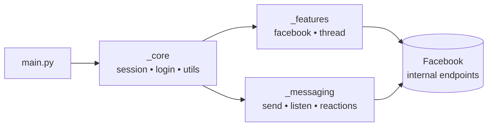
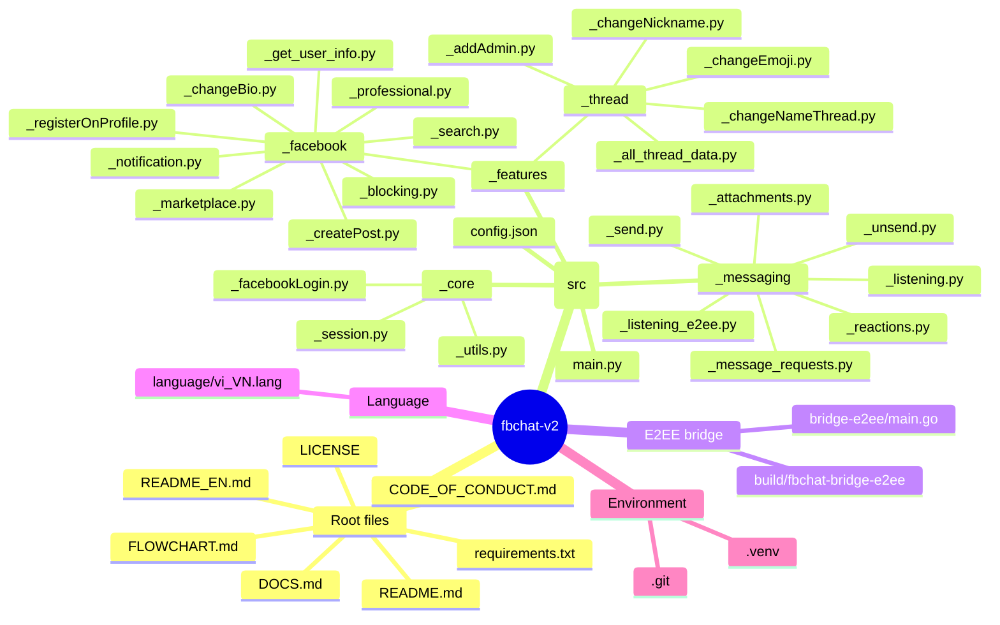

<div align="center">

# FBChat-Remake — Open Source

### A modern, account-based Python library for the unofficial Facebook Messenger API

[](https://github.com/MinhHuyDev/fbchat-v2)
[](https://www.python.org/)
[](https://github.com/MinhHuyDev/fbchat-v2/releases)
[](https://github.com/MinhHuyDev/fbchat-v2/issues)
[](LICENSE)
[](https://t.me/MinhHuyDev)

[**🇻🇳 Tiếng Việt**](README.md) · [**📖 Docs**](DOCS.md) · [**📊 Flowchart**](FLOWCHART.md) · [**🐛 Report a bug**](https://github.com/MinhHuyDev/fbchat-v2/issues)

</div>

---

## 📢 Important Notice

> Since **November 2024**, Facebook has officially rolled out **End-to-End Encryption (E2EE)** for all user-to-user conversations on Messenger.
>
> **Update — May 12, 2026:** `fbchat-v2` now **officially supports E2EE decryption** for direct Messenger messages through the new module [`_messaging/_listening_e2ee.py`](src/_messaging/_listening_e2ee.py) backed by the Go binary [`bridge-e2ee/`](bridge-e2ee/). The event payload schema is **identical** to the legacy `_listening.py` — just swap the import.
>
> Group messages still use `_listening.py` (MQTT WebSocket); 1–1 messages use `_listening_e2ee.py`.

> ⚠️ **Disclaimer** — This project is **not** an official Facebook product. Facebook ships an official Messenger Platform API for chatbots [here](https://developers.facebook.com/docs/messenger-platform/). `fbchat-v2` is different in that it authenticates with **regular Facebook user accounts / cookies**, which carries inherent risk. Use at your own discretion.

---

## 👋 About

Hello, I am **MinhHuyDev** / **raintee.dev** — the author and maintainer of this project.

First and foremost, a heartfelt thank-you to every contributor — both inside and outside Vietnam — who has shared ideas and reported issues. The **major v2.x update** ships a complete restructure of the codebase, fixes the vast majority of long-standing minor bugs, and lays the groundwork for upcoming features such as E2EE and full `async`/`await` support.

There are still rough edges and inconsistencies left to polish. If you spot any, please open an issue on [GitHub](https://github.com/MinhHuyDev/fbchat-v2/issues) or reach out on [Telegram](https://t.me/MinhHuyDev).

---

## 📑 Table of Contents

- [Features](#-features)
- [Architecture Overview](#-architecture-overview)
- [Project Structure](#-project-structure)
- [Requirements](#-requirements)
- [Installation](#-installation)
- [Quick Start](#-quick-start)
- [Configuration](#-configuration)
- [Module Documentation](#-module-documentation)
- [Roadmap](#-roadmap)
- [Contributing](#-contributing)
- [Acknowledgements](#-acknowledgements)
- [License](#-license)

---

## ✨ Features

`fbchat-v2` follows a fundamentally different approach from the official SDK: instead of operating on a single fanpage with an `access_token`, it drives a real Facebook account through cookies or credentials, unlocking the full Messenger surface.

### Authentication
- 🔐 Login via **username / password** or **session cookies** (*)
- 🍪 Persistent session reuse — no need to re-authenticate every run

### Messaging
- 📥 Read messages from both **users** and **group chats (threads)**
- � **E2EE listener** for direct Messenger messages (Secret Conversations / Labyrinth) via a Go bridge
- �📤 Send text, **files**, **stickers**, and **mentions**
- 🔍 Search messages and conversation threads
- ↩️ React, unsend, and handle message requests
- 📡 Real-time **listener** for instant command-driven replies

### Threads & Groups
- 👥 Create groups, add admins, change thread name / emoji / nicknames
- 📊 Create polls and inspect full thread metadata

### Facebook Features (`_features._facebook`)
- 📝 Create posts, change bio, register on profile
- 👤 Search users, fetch profile info, manage notifications
- 🚫 Block / unblock, manage Marketplace and Professional mode

### Coming Soon
- ⚡ Native `async` / `await` support
- � Pre-built E2EE bridge binaries for Windows / Linux / macOS

> (*) Cookie / credential-based login carries security risk; never share your tokens.

---

## 🏗 Architecture Overview

The codebase is intentionally split into **three clean layers**:

| Layer | Path | Responsibility |
|---|---|---|
| **Core** | `src/_core/` | Session, login, request helpers, low-level utilities |
| **Features** | `src/_features/` | Facebook & thread business logic (posts, groups, profile, …) |
| **Messaging** | `src/_messaging/` | Send / receive / react / listen / unsend — everything chat-related |



📊 A full visual flowchart is available in [FLOWCHART.md](FLOWCHART.md).

---

## 📂 Project Structure

```text
fbchat-v2/
├── src/
│   ├── main.py                          # Entry-point demo bot
│   ├── config.json                      # Cookies + runtime config
│   ├── _core/                           # ── Foundation layer ──
│   │   ├── _facebookLogin.py
│   │   ├── _session.py
│   │   └── _utils.py
│   ├── _features/                       # ── Feature layer ──
│   │   ├── _facebook/
│   │   │   ├── _blocking.py
│   │   │   ├── _changeBio.py
│   │   │   ├── _createPost.py
│   │   │   ├── _get_user_info.py
│   │   │   ├── _marketplace.py
│   │   │   ├── _notification.py
│   │   │   ├── _professional.py
│   │   │   ├── _registerOnProfile.py
│   │   │   └── _search.py
│   │   └── _thread/
│   │       ├── _addAdmin.py
│   │       ├── _all_thread_data.py
│   │       ├── _changeEmoji.py
│   │       ├── _changeNameThread.py
│   │       └── _changeNickname.py
│   └── _messaging/                      # ── Messaging layer ──
│       ├── _attachments.py
│       ├── _listening.py                # MQTT — group messages
│       ├── _listening_e2ee.py           # Go bridge — 1-on-1 E2EE messages
│       ├── _message_requests.py
│       ├── _reactions.py
│       ├── _send.py
│       └── _unsend.py
├── bridge-e2ee/                         # ── Go bridge for E2EE ──
│   ├── main.go
│   ├── go.mod
│   └── README.md
├── build/                               # `fbchat-bridge-e2ee[.exe]` produced by `go build`
├── language/
│   └── vi_VN.lang                       # Localization
├── docs/                                # Extended documentation
├── DOCS.md
├── FLOWCHART.md
├── CODE_OF_CONDUCT.md
├── LICENSE
└── requirements.txt
```

Each subfolder ships its own `README.md` (Vietnamese) and `README_EN.md` (English) with module-level details.

### Project mindmap



---

## 🔧 Requirements

| Component | Minimum | Recommended | Notes |
|---|---|---|---|
| Python | 3.10 | 3.11 / 3.12 | Required |
| Go (toolchain) | 1.24 | 1.24+ | **Only needed for E2EE** — to build `fbchat-bridge-e2ee` |
| Git | any | latest | Needed for `go mod tidy` to fetch `mautrix/meta` |
| OS | Windows / Linux / macOS | — | — |
| RAM | 256 MB | 1 GB+ | The E2EE bridge uses ~80–150 MB at runtime |
| Network | Stable connection, unrestricted access to `facebook.com` and `edge-chat.facebook.com` | — | — |

Python dependencies are pinned in [requirements.txt](requirements.txt):

```text
requests>=2.31.0   # HTTP client
paho-mqtt>=1.6.1   # MQTT WebSocket for _listening.py
attrs>=23.2.0      # Decorator class
pyotp>=2.9.0       # 2FA TOTP when logging in with username/password
```

---

## 📦 Installation

> TL;DR: **Steps 1–4 are required** for everyone. **Step 5 is only required if you want to receive 1-on-1 (E2EE) messages**.

### 1. Clone the repository

```bash
git clone https://github.com/MinhHuyDev/fbchat-v2
cd fbchat-v2
```

> Alternative: `Code → Download ZIP` on GitHub.

### 2. Create a virtual environment *(optional but recommended)*

```bash
python -m venv .venv
```

Activate it:

```bash
# Windows (PowerShell)
.venv\Scripts\activate

# macOS / Linux
source .venv/bin/activate
```

### 3. Install Python dependencies

```bash
pip install --upgrade pip
pip install -r requirements.txt
```

Quick sanity check:

```bash
python -c "import requests, paho.mqtt.client, attr, pyotp; print('OK')"
```

### 4. Make `src/` importable

When running scripts from the project root, expose the `src/` folder so that `_core`, `_features`, and `_messaging` resolve correctly:

```bash
# Windows (PowerShell)
$env:PYTHONPATH = "src"

# macOS / Linux
export PYTHONPATH=src
```

Alternatively, import the modules manually with the full `src.` prefix.

### 5. *(Optional)* Build the E2EE bridge — for 1-on-1 messages

If you only need group messages, **skip this step**. Otherwise, direct (E2EE) messages require the Go binary `fbchat-bridge-e2ee`.

#### 5.1. Install the Go toolchain

- Download: <https://go.dev/dl/> (Go ≥ 1.24).
- Open a fresh terminal and verify:

  ```bash
  go version
  ```

#### 5.2. Fetch the `mautrix/meta` source

```bash
cd bridge-e2ee
git clone https://github.com/mautrix/meta.git ./meta
```

> The `go.mod` inside `bridge-e2ee/` uses a `replace` directive pointing to `./meta`, so cloning to **this exact path** is mandatory.

#### 5.3. Download deps & build

```bash
go mod tidy

# Windows
go build -ldflags="-s -w" -o ../build/fbchat-bridge-e2ee.exe .

# Linux / macOS
go build -ldflags="-s -w" -o ../build/fbchat-bridge-e2ee .
```

The first build takes a few minutes (~300 MB Go module cache). The resulting binary is roughly 25–40 MB and lives in `fbchat-v2/build/`.

#### 5.4. Verify

```bash
cd ..
# Windows
.\build\fbchat-bridge-e2ee.exe --help
# Linux/macOS
./build/fbchat-bridge-e2ee --help
```

If the binary is not at the default location, set the env var:

```bash
# Windows
$env:FBCHAT_E2EE_BIN = "C:\path\to\fbchat-bridge-e2ee.exe"
# Linux/macOS
export FBCHAT_E2EE_BIN=/path/to/fbchat-bridge-e2ee
```

More details: [`bridge-e2ee/README.md`](bridge-e2ee/README.md).

### 6. Configure cookies

Open [`src/config.json`](src/config.json) and paste your Facebook session cookies into the `cookies` field. See the [Configuration](#-configuration) section for details.

### 7. Smoke test

```bash
python src/main.py
```

If the console prints account info plus a `last_seq_id`, your installation is complete.

---

## 🚀 Quick Start

A minimal demo bot ships in [`src/main.py`](src/main.py). It contains a handful of basic commands so you can verify your setup and use the structure as a template for your own bot.

```bash
python src/main.py
```

Before running:

1. Open `src/config.json`.
2. Paste your Facebook session cookies into the `cookies` field.
3. (Optional) tweak any other runtime options exposed by the file.

### Enable the E2EE listener (1-on-1 chats)

E2EE requires the Go binary `fbchat-bridge-e2ee`. Build it once:

```bash
cd bridge-e2ee
git clone https://github.com/mautrix/meta.git ./meta
go mod tidy
go build -ldflags="-s -w" -o ../build/fbchat-bridge-e2ee.exe .   # Windows
# Linux/macOS: drop the .exe suffix
```

Then use it just like `_listening.py`:

```python
import threading
from _messaging._listening_e2ee import listeningE2EEEvent

listener = listeningE2EEEvent(dataFB)
listener.get_last_seq_id()
threading.Thread(target=listener.connect_mqtt, daemon=True).start()
# listener.bodyResults follows the same schema as _listening.py
```

Override the binary path with the env var `FBCHAT_E2EE_BIN=/path/to/binary`.
Full build & RPC docs: [`bridge-e2ee/README.md`](bridge-e2ee/README.md).

#### 📸 Demo — receiving a decrypted E2EE direct message

<div align="center">


<sub><i>Real output of <code>listeningE2EEEvent</code> — <code>bodyResults</code> keeps the exact schema of the legacy <code>_listening.py</code>.</i></sub>

</div>

---

## ⚙️ Configuration

`src/config.json` is the single source of truth for runtime settings.

| Key | Description |
|---|---|
| `cookies` | Your Facebook session cookies (string or object form). **Required.** |
| `…` | Additional fields documented inline and in [DOCS.md](DOCS.md). |

> 🔒 **Security:** Treat `config.json` as a secret. Never commit it to a public repository, never share your cookies, and rotate them if you suspect leakage.

---

## 📚 Module Documentation

Every layer ships its own README. Start there for in-depth API examples:

| Module | English | Vietnamese |
|---|---|---|
| `_core` | `src/_core/README_EN.md` | `src/_core/README.md` |
| `_features` | `src/_features/README_EN.md` | `src/_features/README.md` |
| `_messaging` | `src/_messaging/README_EN.md` | `src/_messaging/README.md` |
| Localization | `language/README.md` | — |

For the cross-cutting design and end-to-end request flow, read [DOCS.md](DOCS.md) and [FLOWCHART.md](FLOWCHART.md).

---

## 🗺 Roadmap

- [x] Messenger **E2EE** direct-message decryption *(v2.x — Go bridge)*
- [ ] Native `async` / `await` API
- [ ] Ship the E2EE bridge as pre-built binaries with each release
- [ ] Type hints across the entire public surface
- [ ] Pluggable storage backend for sessions
- [ ] More integration tests & CI

Have ideas? Drop them in [Issues](https://github.com/MinhHuyDev/fbchat-v2/issues).

---

## 🤝 Contributing

Contributions are warmly welcome.

1. **Fork** the repository and create a feature branch:
   ```bash
   git checkout -b feat/<your-feature>
   ```
2. Follow the existing code style and the layered architecture (`_core` → `_features` / `_messaging`).
3. Use [Conventional Commits](https://www.conventionalcommits.org/) — e.g. `feat:`, `fix:`, `docs:`, `refactor:`.
4. Open a Pull Request with a clear description, reproduction steps (for fixes), and screenshots/logs where helpful.
5. Never commit secrets — `config.json`, cookies, tokens, `.venv`, etc. are git-ignored for a reason.

Please also read [CODE_OF_CONDUCT.md](CODE_OF_CONDUCT.md) before participating.

---

## 🌟 Acknowledgements

Across **4 years** of development, this project would not exist without the community. Heartfelt thanks to every contributor who shared ideas, opened issues, and helped keep `fbchat` alive.

### 👥 Community contributors

- [tomdev112](https://github.com/tomdev211)
- [syrex1013](https://github.com/syrex1013)
- [Kheir Eddine](https://www.facebook.com/61557637127396/)
- 陶世玉
- Jihadi John
- [Bắc Trịnh](https://www.facebook.com/1228855777/)
- [Quang Trần](https://www.facebook.com/100005048402622/)
- [Minh Trần Ngọc](https://www.facebook.com/100000277273223/)
- Victor Knutsenberger
- [Hoàng Lân](https://www.facebook.com/100026754347158/)
- Kareem Adel Abomandor
- @lluevy · @phuncnheo · @minhphatnw · @khanh235a · @chapesh1 · @klongg13 · @seafibrahem · @agent1047 · @stefekdziura

### 🔓 Upstream projects that made **v2.1.0 (E2EE)** possible

- [`mautrix/meta`](https://github.com/mautrix/meta) — Go implementation of Meta Labyrinth / Lightspeed.
- [`tulir/whatsmeow`](https://github.com/tulir/whatsmeow) — Signal Protocol (Curve25519, Double Ratchet, Sender Keys, Noise XX) for Go.
- [`yumi-team/meta-messenger.js`](https://github.com/yumi-team/meta-messenger.js) — design reference for the JSON-RPC bridge.
- [`mautrix/go`](https://github.com/mautrix/go) — helper utilities for Matrix / Meta clients.

### 🤖 AI assistants

- *Claude Opus 4.7* (Anthropic) — code review, documentation, refactoring.
- *Codex 5.3* (OpenAI) — boilerplate generation, RPC prototyping.

> If you’ve contributed and your name isn’t listed here, please open an issue or PR — it would be my pleasure to add you.

---

## 📜 License

Distributed under the terms described in [LICENSE](LICENSE). Please review it before using the code in production or commercial settings.

---

<div align="center">

**Made with ❤️ by [MinhHuyDev](https://github.com/MinhHuyDev) · [Telegram](https://t.me/MinhHuyDev)**

</div>
